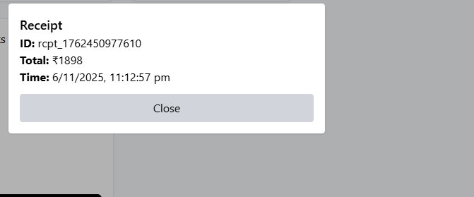

# Vibe Cart — Mock E‑Com Cart

Lightweight full-stack shopping cart demo (React + Vite frontend, Express + SQLite backend).

## 🎥 Demo Video

Watch here:  
https://drive.google.com/file/d/1fYBuzWD5qsqJmioWtb-y7gNSnaYQYXac/view?usp=sharing

---

## What you'll find

- `backend/` — Express API, SQLite DB (better-sqlite3), seed data and routes
- `frontend/` — Vite + React UI, Axios API client, Zustand store

## Quick start (Windows / PowerShell)

1. Open PowerShell and go to the project folder (example path used in this repo):

```powershell
Set-Location "C:\Users\rahul\OneDrive\Desktop\Nexora Assignment\vibe-cart"
```

2. Install & run backend (in one terminal):

```powershell
Set-Location .\backend
npm install
npm run dev
```

3. Install & run frontend (in a separate terminal):

```powershell
Set-Location ..\frontend
npm install
npm run dev
```

4. Open the UI in your browser: http://localhost:5173

---

## API (quick reference)

- GET /api/products — list products
- GET /api/cart — cart items + total
- POST /api/cart { productId, qty } — add to cart
- PATCH /api/cart/:id { qty } — update quantity
- DELETE /api/cart/:id — remove item
- POST /api/checkout { name, email, cartItems } — creates a receipt and clears cart

### Quick smoke (PowerShell / curl)

```powershell
# list products
curl http://localhost:5000/api/products

# add item
curl -X POST http://localhost:5000/api/cart -H "Content-Type: application/json" -d "{\"productId\":\"p1\",\"qty\":1}"

# view cart
curl http://localhost:5000/api/cart
```

---

## Screenshots / assets

Place screenshots and demo artifacts under `/assets`:

- `assets/products.png` — products grid
- `assets/cart.png` — cart with 2 items
- `assets/receipt.png` — receipt modal




I added `assets/README.md` explaining how to capture and where to put images.

---

## Demo script (60–90s)

1. Open the app at http://localhost:5173
2. Show product grid
3. Add two different items, change quantity for one
4. Show total on the cart
5. Click Checkout, enter name/email, submit
6. Show receipt id and timestamp
7. Refresh and show cart cleared

Include a link to an unlisted Loom / YouTube video in this README after recording.

---

## Notes & Troubleshooting

- Database: `vibe.db` is created automatically in the `backend/` folder when the server starts. Seed data inserts 5 sample products on first run.
- Windows native build: `better-sqlite3` is a native module. If `npm install` fails during its build, you need the Visual Studio Build Tools (Desktop C++ workload) and/or run the VS Developer Command Prompt so `cl.exe` is available.

   Check for `cl.exe` availability:

```powershell
where.exe cl.exe
```

   If not found install Visual Studio Build Tools → select "Desktop development with C++" and reboot.

- OneDrive and file locks: developing inside OneDrive can cause EPERM errors while removing `node_modules`. If you see permission errors, pause OneDrive syncing and close editors, or move the project to a non-OneDrive folder such as `C:\Projects\vibe-cart`.

---

## Commit & push (recommended)

```powershell
git add .
git commit -m "feat: complete mock e-com cart with checkout and SQLite"
git branch -M main
# create a GitHub repo and add it as origin, or use your existing remote
git remote add origin https://github.com/<your-username>/vibe-cart.git
git push -u origin main
```

If you'd like I can create a repo for you and push (I will need the GitHub repo URL or permission to create one).

---

## Final checklist

- [x] GET /api/products returns 5 items
- [x] POST /api/cart adds items
- [x] PATCH /api/cart/:id updates qty
- [x] DELETE /api/cart/:id removes items
- [x] GET /api/cart returns items + total
- [x] POST /api/checkout returns receipt and clears cart
- [x] Frontend: product grid, cart operations, checkout modal
- [x] Persistence: SQLite DB stored in `backend/vibe.db`

---

If you'd like, I can now: commit these last edits, create a GitHub repo and push the code, and provide the final repo URL and a short submission note you can paste.